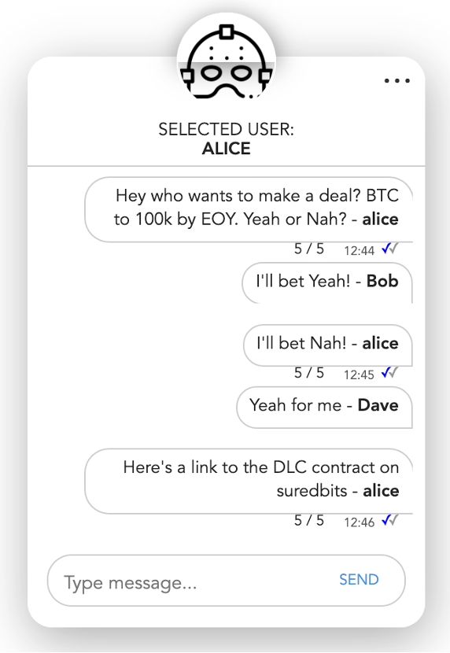
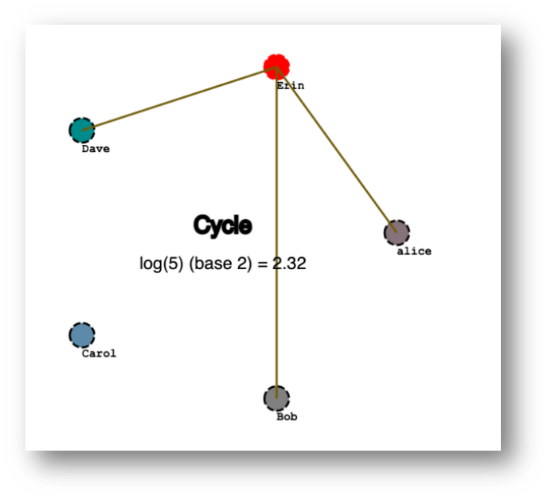

Goss
=====
p2p gossip chat room (for market signals). Built on the the Bitcoin stack: bitcoin => lightning => impervious.ai


<br/>




Quick Start
==========

1. Setup the IMP and lightning network on polar https://github.com/lispmeister/legendary-fiesta.git. You can import the sample config in `IMPNET.polar.zip`
2. `npm i`
3. `./start.sh` or you can open the script and run each imp node in a separate terminal window.
4. open http://localhost:3000


Imp Commands
============

Alice => Bob
===========

Message 
---------
```
curl --location --request POST '127.0.0.1:8882/v1/message/send' \
--header 'Content-Type: application/json' \
--data-raw '{
    "msg": "hello bobby",
    "pubkey": "0352c618f083ec76ba9b85646b535ad3899dfd213fd8e578a4ddcd40fd6d7aef71",
    "amount": "10"
}'
```

Create Invoice
--------------
```
curl --location --request POST '127.0.0.1:8882/v1/lightning/generateinvoice' \
--header 'Content-Type: application/json' \
--data-raw '{
    "amount": 13,
    "pubkey": "0352c618f083ec76ba9b85646b535ad3899dfd213fd8e578a4ddcd40fd6d7aef71",
    "memo": "Pay me bobby"
}'
```

Federate with Bob
---------------
```
curl --location --request POST '127.0.0.1:8882/v1/federate/request' \
--header 'Content-Type: application/json' \
--data-raw '{
    "pubkey": "0352c618f083ec76ba9b85646b535ad3899dfd213fd8e578a4ddcd40fd6d7aef71"
}'
```

Bob => Alice
===========

Message
--------
```
curl --location --request POST '127.0.0.1:9992/v1/message/send' \
--header 'Content-Type: application/json' \
--data-raw '{
    "msg": "hello alice",
    "pubkey": "02de4a3d885a77960a89d0f31b307f0eec47a25e18126dcddf67ef4212d1f5d788"
}'
```

Pay Invoice
--------------
```
curl --location --request POST '127.0.0.1:9992/v1/lightning/payinvoice' \
--header 'Content-Type: application/json' \
--data-raw '{
    "invoice": "lnbcrt130n1pssa5hhpp5lhqklqqg6vznn9e8e0asg4gmn2mk4wsum4t44cmztzl73u6ps6zsdq52pshjgrdv5sxymmzvfuscqzpgsp5rdgeqmvfy9tzs65hlmrw67s6cshr5efyye2cxqltz8r0hwcm9qcs9qyyssq48puyscf3j3tft9zhd4sx2nzynguysz3tradq2xck9h8tp8wnnmxc6hgsyp8wgh25jm7cgzvqapuw30ux8qttvkjzdfej4h223lansqpyhkylf",
    "pubkey": "02de4a3d885a77960a89d0f31b307f0eec47a25e18126dcddf67ef4212d1f5d788"
}'
```

Federate with Alice
------------------
```
curl --location --request POST '127.0.0.1:9992/v1/federate/request' \
--header 'Content-Type: application/json' \
--data-raw '{
    "pubkey": "02de4a3d885a77960a89d0f31b307f0eec47a25e18126dcddf67ef4212d1f5d788"
}'
```
